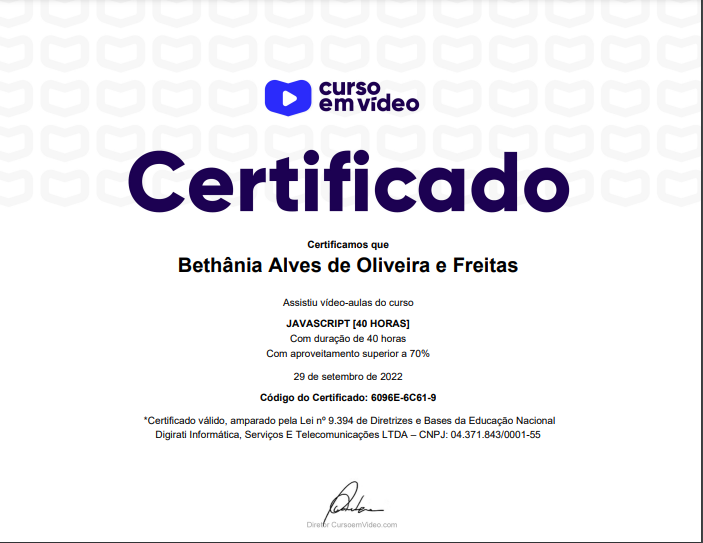

# Curso de JavaScript

Curso de Javascript basico, feito pela plataforma Curso em Video e patrocinio do Google. Com duração de 40 horas.

## Aprendizados:
- fundamentos
- node.js
- variaveis e dados
- operadores
- condições
- repetições
- arrays
- functions
- DOM
- Exercícios

## Certificado:

## Autores

- [Bethania Freitas](https://github.com/Bethania-Freitas)

